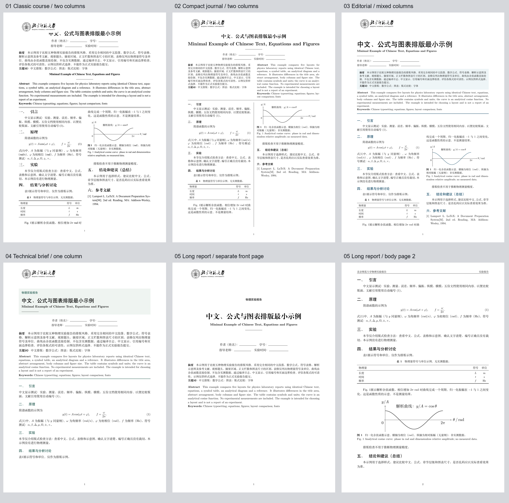
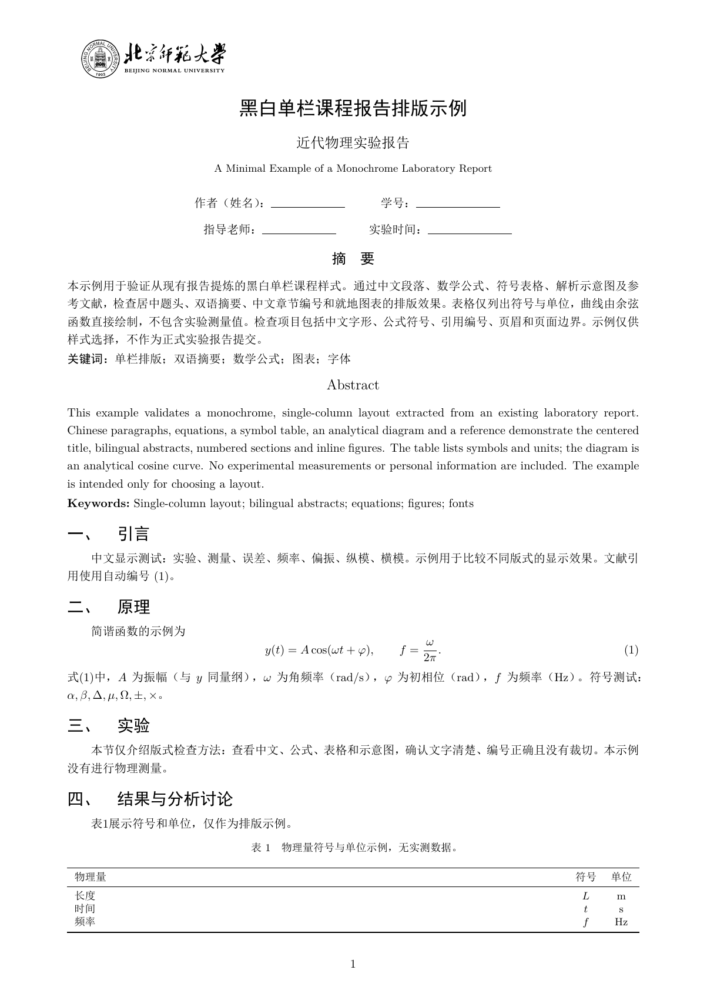

# 实验报告 LaTeX 模板库

内容标准始终是工作区根目录 `report.md`，教师明确规定优先。五套模板仅改变排版；都保留 A4 双栏、两行基本信息、双语摘要与关键词、六个主体章节、校徽、顺序编码引用及可选附录。01 沿用项目已有的 `thuemp.cls`；02—05 使用 `ctexart`，不依赖各出版社的投稿文档类。

| 编号 | 名称 | 主源文件 | 可用别名 | 版式特点 |
| --- | --- | --- | --- | --- |
| 01 | 清华课程双栏（默认） | `template_01_thu.tex` | `thu`、清华、经典 | 经典课程：居中题头、上下双语摘要、传统双栏正文 |
| 02 | Physical Review 风格 | `template_02_physical_review.tex` | `aps`、紧凑学术 | 紧凑学术：双语摘要并排、栏间细线、紧凑双栏正文 |
| 03 | Nature 风格 | `template_03_nature.tex` | `nature`、杂志、混合 | 科研杂志：大标题、浅色摘要区、引言单栏、后文双栏 |
| 04 | Applied Physics Letters 风格 | `template_04_applied_physics_letters.tex` | `apl`、简报 | 技术简报：浅色题头、无首行缩进、单栏宽幅图表 |
| 05 | Journal of Physics 风格 | `template_05_journal_of_physics.tex` | `iop`、长报告 | 学术长报告：独立题头与摘要页、较大字号、单栏正文 |
| 06 | He-Ne 原报告单栏 | `template_06_he_ne.tex` | `he-ne`、氦氖、原报告单栏 | 黑白单栏：宋体/黑体、1.5倍行距、居中摘要标题、就地图表、题目页眉 |

命名、别名和主源路径以 `registry.json` 为准。[SOURCES.md](SOURCES.md) 记录期刊官方来源及适配边界。这些都是课程报告的风格改编，不是官方模板，不承诺可直接用于投稿。版式参数是本项目的设计选择，不声称复刻期刊成稿。

## 已编译的版式预览

01—05使用完全相同内容做MVP对比；06是原报告样式的独立MVP，均不包含实测数据。所有预览均已通过XeLaTeX编译，并检查日志、引用、嵌入字体、中文提取、页面边界和渲染版面。正式写作仍需填写内容并再次编译验收。



| 模板 | PDF预览 |
| --- | --- |
| 01 清华课程双栏 | [预览01](previews/template_01_thu.pdf) |
| 02 Physical Review | [预览02](previews/template_02_physical_review.pdf) |
| 03 Nature | [预览03](previews/template_03_nature.pdf) |
| 04 Applied Physics Letters | [预览04](previews/template_04_applied_physics_letters.pdf) |
| 05 Journal of Physics | [预览05](previews/template_05_journal_of_physics.pdf) |
| 06 He-Ne 原报告单栏 | [预览06](previews/template_06_he_ne.pdf) |

06的设计提炼与调用说明见[DESIGN_06.md](DESIGN_06.md)。它使用独立样式文件及原报告的`ctexart`自动字体设置；在本机继承宋体/黑体，而01—05仍采用各自原有字体设置。英文题目和英文关键词按通用规范补齐，源报告的个人信息、数据和图片不进入模板。



## AI 调用与文件结构

用户可以说：“为塞曼效应写实验报告，使用模板02”“用 Nature 样板写这份报告”或“将这份报告换成模板05，保留正文和数据”。AI 先读 `report.md` 和讲义/记录，再解析编号或别名；无指定时沿用该报告的选择记录，新报告才默认01。

从工作区根目录执行（Python 3.10+）：

```powershell
python skills/Lab_Workflow_Generator/scripts/select_report_template.py --list-templates
python skills/Lab_Workflow_Generator/scripts/select_report_template.py --workspace . --experiment "塞曼效应" --template 02
```

也可在现有工作流的脚手架阶段使用 `--template 02`。生成正文后，依照该 Skill 的检查/编译阶段完成验收。选择命令只部署骨架，不生成实验内容，不代表报告完成。

```text
<实验标题>/lab_report/
├── lab_report.tex                   # 选中模板的主文件；稳定入口
├── template_selection.json          # 选择记录与主文件校验摘要
├── thuemp.cls                       # 01需要的现有类文件
├── assets/bnu_logo.png              # 工作区校徽，不变形
├── report_template/
│   ├── common.tex                   # 共用内容接口与课程约束
│   ├── layout_v2.tex                # 五种结构不同的新版版式
│   ├── layout_06_he_ne.tex           # 06独立黑白单栏样式
│   ├── metadata.tex                 # 题目、基本信息、双语摘要和关键词
│   ├── body.tex                     # 正文、图表与可选附录
│   └── references.bib               # 可核实的参考文献
├── data/ figures/ scripts/ tables/  # 原始数据与复现材料
├── build/                          # 编译辅助文件及日志
└── lab_report.pdf                  # 成功编译后的成品
```

主模板必须连同共享文件部署，不能只复制一个 `.tex` 文件。选中01时还需要 `thuemp.cls`。所有依赖由选择脚本复制；报告正文和元数据只在缺失时创建，不覆盖已有编辑。切换由脚本创建且未被改写的主文件时，保留 `body.tex`、`metadata.tex`、文献及数据。旧报告或手工改过的主文件会阻止自动覆盖；AI 应先迁移内容、检查差异，再切换样式，不能将原报告替换成空骨架。

## 写作、编译与检查

1. 在 `metadata.tex` 填写信息和双语摘要；在 `body.tex` 依据讲义和真实记录写六部分内容；在 `references.bib` 写实际引用的文献。
   有原始材料或教师要求时，将 `metadata.tex` 中的 `\ReportAppendixfalse` 改为 `\ReportAppendixtrue`，启用现成附录骨架；无补充材料的预览默认不显示附录。
2. 缺测信息明确标记待补充，保持原始数据可追溯；所有模板占位图表和占位文献在材料齐全、内容核实后替换，在 `metadata.tex` 改用 `\ReportDraftfalse` 移除灰色“模板草稿”提示。材料不全时只能交付明确标注的草稿。
3. 从 `lab_report/` 编译，运行 XeLaTeX → BibTeX → XeLaTeX → XeLaTeX；编译辅助文件集中在 `build/`，PDF复制至报告目录。01—05使用TeX Live自带Fandol字体，06沿用原报告的ctex自动字体选择（本机宋体/黑体）；教师指定字体时调整并检查。
4. 按 `report.md` 检查章节、摘要字数、关键词、单位、有效数字、公式、不确定度依据、拟合质量、至少两条改进建议和引用；查看日志和渲染后的PDF，确认无越界、重叠、小字、裁切、断裂表格或大面积空白。

```powershell
python skills/Lab_Workflow_Generator/scripts/run_lab_workflow.py --workspace . --experiment "塞曼效应" --stage check
python skills/Lab_Workflow_Generator/scripts/run_lab_workflow.py --workspace . --experiment "塞曼效应" --stage compile
```

`--force` 仍遵循原工作流的讲义状态约定，不用于跳过模板的防覆盖检查。未改写内容的模板编译成功，只能证明排版骨架可用，不能代替正式报告内容验收。

通用模板源和工作流可以进入 Git；每个实验的全部材料、报告及编译成果只保存在本地。

## 同内容样例与兼容说明

2026-09-30 的结构版式由用户确认可包含单栏、双栏及混合布局。课程要求优先，期刊名称仅保留为编号别名，不表示对官方刊物版面的严格复刻。图表宽度应使用`\linewidth`或`\columnwidth`，不将双栏图的固定尺寸直接套用到单栏。

03通过`multicol`在引言之后进入双栏，支持`[H]`就地图表，附录恢复单栏。普通浮动体和跨页长表不适合直接放入`multicols`；有大量此类材料时优先用04/05，或将宽幅补充材料放入附录。

新版排版参数保存在`layout_v2.tex`；选择脚本只补齐缺失文件，不改写已安装的正文、信息和共用文件，手工修改的主文件仍受原有保护。更新模板库不会自动转换任何现有实验报告。

重新生成所有注册样式的独立源码样例（请选择一个尚无同名MVP的目录；可用`--template 06`只生成06）：

```powershell
python skills/Lab_Workflow_Generator/scripts/create_template_mvps.py --output "排版风格对比"
```

样例展开排版和内容输入，01同时附带`thuemp.cls`，校徽保存在`assets/`，编译缓存集中在`build/`。`examples/mvp_metadata.tex`和`examples/mvp_body.tex`是共同内容源。
